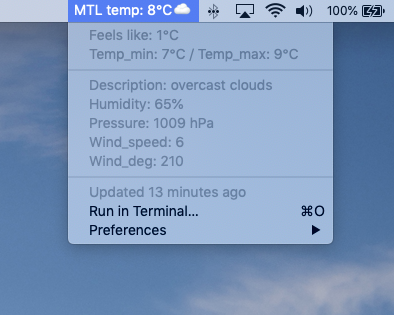

## Bitbar_weather_plugin

weather plugin for the BitBar mac desktop utility (https://getbitbar.com/)

### Operation

- Use Homebrew: `brew cask install bitbar`

- Clone this repo to local and copy 'weather.1h.py' file to your bitbar plugin folder

- Ensure the plugin is executable by running: `chmod +x {path to weather.1h.py}`

- Refresh the Bitbar
